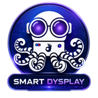

# 📱 SmartDisplay AI (Smart-D)

<div align="center">
  
  <h3>Motor de Streaming de Escritorio y Productividad Remota de Ultra Baja Latencia para Android</h3>
  
  [-3DDC84.svg?style=for-the-badge&logo=android)](https://www.android.com/)
  [](https://github.com/LizardByte/Sunshine)
  [](LICENSE.txt)
</div>

---

## 🌟 ¿Qué es SmartDisplay AI?

**SmartDisplay AI (Smart-D)** es una plataforma cliente de alto rendimiento para Android, construida sobre el protocolo de transmisión de ultra baja latencia de Moonlight y Sunshine, rediseñada específicamente para **productividad remota, programación, desarrollo de software y control de escritorio profesional**, además de gaming en streaming.

Permite convertir cualquier teléfono o tablet Android en una segunda pantalla interactiva o estación de trabajo móvil remota conectada a tu PC Windows o Linux con latencia mínima, soporte de entrada completo y herramientas para desarrolladores.

---

## 🚀 Características Principales

### ⌨️ Teclado Virtual DEV de Alto Rendimiento
- **Distribución QWERTY Completa de 59 Teclas**: Fila numérica, modificadores reales (Ctrl, Alt, Shift, Win), tabulador, escape y flechas direccionales.
- **Perfiles de Desarrollo Nativos (DEV Profiles)**:
  - **VS Code**: Atajos oficiales de Windows (`Ctrl+Alt+I` Chat, `Ctrl+I` Inline Chat, `Ctrl+P` Quick Open, `Ctrl+Shift+P` Paleta, `Ctrl+Shift+F` Búsqueda, etc.).
  - **Android Studio**: `Shift+F10` Run, `Shift+F9` Debug, `Ctrl+F9` Make, `Alt+6` Logcat, `Alt+1` Project, `Alt+Enter` Quick Fix, `Double Shift` Search Everywhere.
  - **IntelliJ IDEA**: `Double Shift`, `Ctrl+Shift+A` Find Action, `Ctrl+B` Declaración, `Ctrl+Alt+L` Reformat, `Alt+F12` Terminal.
  - **OpenCode TUI**: Soporte de secuencias de **Leader Key (`Ctrl+X`)** (`Leader → E` Editor, `Leader → B` Sidebar, `Leader → N` Sesión).
  - **Antigravity AI**: Integración fluida con el entorno de desarrollo asistido por IA.
  - **DEV Universal**: Fila completa de teclas `F1` a `F12`, `Ins`, `Del`, `Home`, `End`, `PgUp`, `PgDn`, `PrtSc`, `Menu`.
- **Máquina de Modificadores Sticky**: Modos `ONE_SHOT` y `LOCKED` con retroalimentación visual en el header.
- **Pinch-to-Scale Seguro**: Escalado dinámico con zoom seguro (`0.78×` a `1.15×`) y desplazamiento automático del stream para escribir sin tapar el código.
- **Efectos Visuales**: Iluminación RGB cromática dinámica.

### 🎨 Diseño Liquid Glass UI Responsive
- **Diseño Compacto y Optimizado**: Componentes y tarjetas con límites de ancho máximos (`layout_constraintWidth_max`) para evitar solapamientos o estiramientos en landscape.
- **Micro-animaciones Suaves**: Indicadores de estado, hero orbs de conexión con respiración 3D y transparencias de cristal líquido.
- **Navegación Intuitiva**: Soporte total para orientaciones vertical (portrait) y horizontal (landscape) en teléfonos, pantallas plegables y tablets.

### ⚡ Herramientas de Conectividad y Companion Server
- **Wake-on-LAN (WOL)**: Encendido remoto de equipos por red local y Wi-Fi con scripts dedicados.
- **Transferencia de Archivos**: Envío rápido de archivos entre el dispositivo móvil y el equipo host.
- **Selector de Temas Dinámicos**: Personalización del estilo visual de la aplicación.
- **HUD de Diagnóstico**: Monitoreo en tiempo real de FPS, bitrate, jitter de red, pérdidas de paquetes y latencia de decodificación.

---

## 🛠️ Arquitectura del Proyecto

```text
SmartDisplay/Android/
├── app/
│   ├── src/main/java/com/limelight/
│   │   ├── ui/
│   │   │   ├── keyboard/           # Motor de Teclado DEV, Layouts y Perfiles
│   │   │   │   ├── KeyboardLayoutEngine.kt
│   │   │   │   ├── KeyboardInputHandler.kt
│   │   │   │   ├── KeyboardProfileEngine.kt
│   │   │   │   └── KeyboardState.kt
│   │   │   ├── glass/              # Componentes visuales Liquid Glass
│   │   │   └── LogicalKeyboardOverlay.kt
│   │   ├── nvstream/               # Capa de comunicación de streaming
│   │   │   ├── NvConnection.java
│   │   │   └── jni/MoonBridge.java
│   │   └── PcView.java             # Pantalla principal del dashboard
│   ├── src/main/jni/               # Módulos nativos C/C++ (moonlight-core)
│   └── src/main/res/               # Layouts XML, temas, drawables y strings
├── companion_server/               # Servidor auxiliar en Python para Windows
└── docs/                           # Documentación y auditorías de arquitectura
```

---

## 💻 Compilación e Instalación

### Requisitos Previos:
- **Android Studio** Ladybug (o superior) / IntelliJ IDEA.
- **Android SDK** API 35 (Android 15) con NDK instalado.
- **JDK 17+**.
- Conexión a un host con **Sunshine** o **NVIDIA GeForce Experience (GameStream)**.

### Pasos de Compilación:

1. **Clonar el repositorio:**
   ```bash
   git clone https://github.com/emmahiguita/Smart-D.git
   cd Smart-D
   ```

2. **Inicializar submódulos nativos:**
   ```bash
   git submodule update --init --recursive
   ```

3. **Compilar e Instalar en Dispositivo:**
   ```bash
   # Compilar APK Debug
   ./gradlew :app:assembleNonRootDebug

   # Instalar directamente en el dispositivo conectado vía ADB:
   ./gradlew :app:installNonRootDebug
   ```

---

## 📄 Licencia

Este proyecto está bajo la licencia **GNU General Public License v3.0 (GPL-3.0)**. Consulta el archivo [LICENSE.txt](LICENSE.txt) para más detalles.

---

<div align="center">
  <sub>Desarrollado con ❤️ para llevar el control y desarrollo de escritorio al máximo nivel en dispositivos móviles.</sub>
</div>
